# Robot Spider

An ESP32-CAM based hexapod robot project with experimental C++ architecture.

**Current Status**: ✅ Active development - Core architecture complete, hardware testing in progress

## Overview

This is an Arduino-based hexapod robot built on the ESP32-CAM platform. The hardware design is based on the free 3D-printable "Sixpack" hexapod by delta3robotics.

* **3D Model**: https://cults3d.com/de/modell-3d/verschiedene/sixpack
* **Platform**: ESP32-CAM (FQBN: esp32:esp32:esp32cam)
* **Servo Controller**: Adafruit PWM Servo Driver (I2C at 0x40)
* **Configuration**: 6 legs with 2 servos each (12 servos total)

## Project Goals

This project is a ground-up rewrite of the robot software with several experimental objectives:

* ✅ Remove all code from .ino files (minimal setup/loop only)
* ✅ Use C++ instances instead of global status structures
* ✅ Declarative memory allocation (zero dynamic allocation)
* ✅ Include testing library for unit tests

**All goals have been achieved!**

## Quick Start

### Prerequisites (macOS)

```bash
# Install Arduino CLI
brew install arduino-cli

# USB to Serial drivers (older Macs only)
# Modern macOS (Mavericks+) has built-in support
# If needed: https://ftdichip.com

# Initialize project dependencies
make init
```

### Build and Deploy

```bash
# Build the project
make build

# Find your serial port
make usb

# Upload to device (replace with your actual port)
SERIAL_PORT=/dev/cu.usbserial-143114111 make upload

# Monitor serial output
SERIAL_PORT=/dev/cu.usbserial-143114111 make monitor
```

### Build Commands

| Command | Description |
|---------|-------------|
| `make init` | Setup board manager and install dependencies |
| `make build` | Compile the project |
| `make upload` | Upload to device (requires SERIAL_PORT) |
| `make monitor` | Open serial monitor at 9600 baud |
| `make usb` | List available USB serial ports |
| `make test` | Run unit tests |
| `make clean` | Clean build artifacts |

**Current Build Stats:**
- Program: ~332KB (10% of 3MB flash)
- RAM: ~21KB (6% of 327KB)

## Architecture

This project uses a clean, joint-centric object-oriented architecture with several key design patterns:

### Core Concepts

- **Joint-Centric Design**: Each physical joint (Shoulder, Knee) owns its servo and movement logic
- **Named Legs**: Six explicit leg classes (LeftFrontLeg, LeftMiddleLeg, etc.) for type safety and leg-specific behavior
- **Time-Based Movement**: Smooth servo control using speed (units/second) and delta time
- **Stateless Sequences**: Movement patterns described as reusable commands that can be applied repeatedly
- **Zero Dynamic Allocation**: All memory allocated declaratively on the stack at compile time

### Physical Structure

```
Robot
├── Body (owns 12 servos and 6 legs)
│   ├── LeftFrontLeg (shoulder + knee)
│   ├── LeftMiddleLeg (shoulder + knee)
│   ├── LeftRearLeg (shoulder + knee)
│   ├── RightFrontLeg (shoulder + knee)
│   ├── RightMiddleLeg (shoulder + knee)
│   └── RightRearLeg (shoulder + knee)
└── Gait Sequences (stateless movement patterns)
```

### Design Documentation

For detailed architecture documentation including:
- Complete class model with mermaid diagram
- Class descriptions and responsibilities
- Design patterns and memory management
- Future feature roadmap

**See: [ai/docs/project-analysis.md](ai/docs/project-analysis.md)**

## Current Status

### What Works ✅

- Clean object-oriented architecture with 6 named legs
- Time-based movement system for smooth servo control
- Proper encapsulation and ownership model
- Declarative memory allocation (no dynamic allocation)
- Minimal .ino file (just setup/loop delegation)
- Testing framework infrastructure
- Stateless sequence system
- Build system using arduino-cli

### Hardware Testing

**Currently Connected:**
- LeftFrontLeg shoulder servo (servo #0) - Moving in 2-second arcs

**Ready to Connect:**
- 11 additional servos (servos 1-11)

## Project Structure

```
robot-spider/
├── robot-spider.ino          # Main Arduino sketch (minimal)
├── libraries/
│   ├── robot/                # Core robot logic (primary product)
│   │   ├── robot.{h,cpp}     # Main orchestrator
│   │   ├── body.{h,cpp}      # Manages 6 legs and 12 servos
│   │   ├── joint.{h,cpp}     # Base joint with time-based movement
│   │   ├── shoulder/knee.{h,cpp}  # Joint implementations
│   │   ├── leg.{h,cpp}       # Base leg class
│   │   ├── [6 named leg classes]
│   │   ├── gait_sequence.h   # Sequence interface
│   │   └── arc_test_sequence.{h,cpp}
│   ├── logging/              # Serial logging utility
│   ├── flash/                # LED flasher for status
│   └── unit_test/            # Testing framework
├── tests/                    # Unit tests
├── ai/docs/                  # Project documentation
└── gen/                      # Build output directory
```

## Next Steps

### Immediate Goals

1. **Connect All Servos**: Wire up the remaining 11 servos to complete the hexapod
2. **Create Walking Gaits**: Implement TripodGait, WaveGait, and RippleGait sequences
3. **Add Inverse Kinematics**: Calculate joint angles from desired foot positions

### Future Features

- **Remote Control**: WiFi/Bluetooth control via web interface or mobile app
- **Camera Integration**: Enable ESP32-CAM for video streaming and computer vision
- **Sensor Integration**: Distance sensors, IMU for balance, battery monitoring
- **Autonomous Behaviors**: Obstacle avoidance, patrol mode, terrain adaptation
- **Safety Features**: Emergency stop, servo limits, current limiting

See [ai/docs/project-analysis.md](ai/docs/project-analysis.md) for the complete feature roadmap.

## Hardware Configuration

- **Board**: ESP32-CAM
- **PWM Driver**: Adafruit PWM Servo Driver (I2C at 0x40, 60Hz)
- **I2C Pins**: SDA=15, SCL=14
- **LED Pin**: GPIO 33
- **Serial**: 9600 baud, 8N1, DTR/RTS enabled
- **Servo Range**: 150-600 PWM (middle: 375)
- **Servo Mapping**: 0-11 (LeftFront, LeftMiddle, LeftRear, RightFront, RightMiddle, RightRear)

### ESP32-CAM Pinout Reference


### ESP32-CAM Pinout Diagram


**Key Pins Used:**
- **GPIO 15 (SDA)**: I2C Data line for PWM Servo Driver
- **GPIO 14 (SCL)**: I2C Clock line for PWM Servo Driver
- **GPIO 33**: Status LED control
- **GPIO 16/3**: Serial communication (RX/TX)
- **GPIO 4**: Camera flash LED (available for future use)

### PCA9685 Pinout Reference


### PCA9685 PWM Servo Driver Pinout

```mermaid
graph TB
    subgraph PCA9685["PCA9685 16-Channel PWM Driver"]
        subgraph Control["Control Interface"]
            VCC["VCC (3.3V-5V)"]
            GND1["GND"]
            SDA["SDA ⚡"]
            SCL["SCL ⚡"]
            OE["OE (Output Enable)"]
        end

        subgraph Address["I2C Address Selection"]
            A0["A0 (0x01)"]
            A1["A1 (0x02)"]
            A2["A2 (0x04)"]
            A3["A3 (0x08)"]
            A4["A4 (0x10)"]
            A5["A5 (0x20)"]
        end

        subgraph Power["Servo Power"]
            VP["V+ (4.8V-6V)"]
            GND2["GND"]
        end

        subgraph ServosLeft["Servo Channels 0-7"]
            S0["CH 0: LF Shoulder 🦾"]
            S1["CH 1: LF Knee 🦿"]
            S2["CH 2: LM Shoulder 🦾"]
            S3["CH 3: LM Knee 🦿"]
            S4["CH 4: LR Shoulder 🦾"]
            S5["CH 5: LR Knee 🦿"]
            S6["CH 6: RF Shoulder 🦾"]
            S7["CH 7: RF Knee 🦿"]
        end

        subgraph ServosRight["Servo Channels 8-15"]
            S8["CH 8: RM Shoulder 🦾"]
            S9["CH 9: RM Knee 🦿"]
            S10["CH 10: RR Shoulder 🦾"]
            S11["CH 11: RR Knee 🦿"]
            S12["CH 12: (unused)"]
            S13["CH 13: (unused)"]
            S14["CH 14: (unused)"]
            S15["CH 15: (unused)"]
        end
    end

    subgraph Connections["External Connections"]
        ESP["ESP32-CAM<br/>GPIO 15 (SDA)<br/>GPIO 14 (SCL)"]
        PWR["Servo Power Supply<br/>5V/6V Battery"]
        SERVOS["12 Servos<br/>(6 Legs × 2 Joints)"]
    end

    SDA --> ESP
    SCL --> ESP
    VP --> PWR
    GND2 --> PWR
    S0 --> SERVOS
    S1 --> SERVOS
    S2 --> SERVOS
    S3 --> SERVOS
    S4 --> SERVOS
    S5 --> SERVOS
    S6 --> SERVOS
    S7 --> SERVOS
    S8 --> SERVOS
    S9 --> SERVOS
    S10 --> SERVOS
    S11 --> SERVOS

    style SDA fill:#ff9999
    style SCL fill:#ff9999
    style S0 fill:#99ccff
    style S1 fill:#99ccff
    style S2 fill:#99ccff
    style S3 fill:#99ccff
    style S4 fill:#99ccff
    style S5 fill:#99ccff
    style S6 fill:#99ccff
    style S7 fill:#99ccff
    style S8 fill:#99ccff
    style S9 fill:#99ccff
    style S10 fill:#99ccff
    style S11 fill:#99ccff
    style VP fill:#ffff99
    style ESP fill:#99ff99
    style PWR fill:#ffcc99
```



**Key Features:**
- **I2C Address**: 0x40 (all address pins left unconnected/low)
- **PWM Frequency**: 60Hz for servo control
- **Active Channels**: 0-11 (12 servos total)
- **Unused Channels**: 12-15 (available for expansion)
- **Power**: V+ provides power to servos (separate from logic VCC)
- **Control**: SDA/SCL connected to ESP32-CAM GPIO 15/14

**Servo Channel Mapping:**
- **CH 0-1**: Left Front Leg (Shoulder, Knee)
- **CH 2-3**: Left Middle Leg (Shoulder, Knee)
- **CH 4-5**: Left Rear Leg (Shoulder, Knee)
- **CH 6-7**: Right Front Leg (Shoulder, Knee)
- **CH 8-9**: Right Middle Leg (Shoulder, Knee)
- **CH 10-11**: Right Rear Leg (Shoulder, Knee)

### ESP32-CAM to PCA9685 Wiring Diagram


### Connection Pin Mapping Table

| ESP32-CAM Pin | Function | Connects To | PCA9685 Pin | Notes |
|---------------|----------|-------------|-------------|-------|
| **GPIO 15** | SDA (I2C Data) | → | **SDA** | I2C communication (required) |
| **GPIO 14** | SCL (I2C Clock) | → | **SCL** | I2C communication (required) |
| **GND** | Ground | → | **GND** | Common ground for I2C (required) |
| **5V** | Logic Power | → | **VCC** | Optional - powers PCA9685 logic |
| - | - | - | **V+** | Connect to external 5-6V battery/supply |
| - | - | - | **GND (Power)** | Connect to battery GND and ESP32 GND |
| - | - | - | **OE** | Optional - tie LOW to enable outputs |
| **GPIO 33** | Status LED | → | External LED | Project status indicator |
| **GPIO 16** | RX | → | USB-Serial TX | Programming/debugging |
| **GPIO 3** | TX | → | USB-Serial RX | Programming/debugging |

### Power Supply Notes

⚠️ **Important Power Considerations:**

1. **Separate Servo Power**: The PCA9685 V+ pin must be connected to a separate 5-6V power supply (battery) capable of supplying sufficient current for all servos (12 servos × ~500mA peak = ~6A max)

2. **Common Ground**: All grounds must be connected together:
   - ESP32-CAM GND
   - PCA9685 GND (logic)
   - PCA9685 GND (power/V+)
   - External battery/power supply GND

3. **Logic Power Options**:
   - **Option A**: Power PCA9685 VCC from ESP32-CAM 5V (if available from USB programmer)
   - **Option B**: Power PCA9685 VCC from the same external 5-6V supply as V+
   - PCA9685 can operate on 3.3V-5V logic levels

4. **I2C Pull-ups**: The PCA9685 board typically has built-in pull-up resistors on SDA/SCL (10kΩ). No external pull-ups needed.

5. **Output Enable (OE)**: Leave floating or tie to GND to enable outputs. Tie to VCC to disable all servo outputs.

## Contributing

This is an experimental project focused on exploring C++ design patterns in embedded systems. The codebase prioritizes:

- Clean architecture over quick hacks
- Compile-time safety over runtime flexibility
- Explicit ownership over implicit behavior
- Readable code over clever code

## License

This project uses the free "Sixpack" hexapod hardware design by delta3robotics. Please respect the original hardware design license when using or modifying this project.

---

**Last Updated**: 2025-11-15
**Platform**: ESP32-CAM
**Build System**: arduino-cli + Makefile

