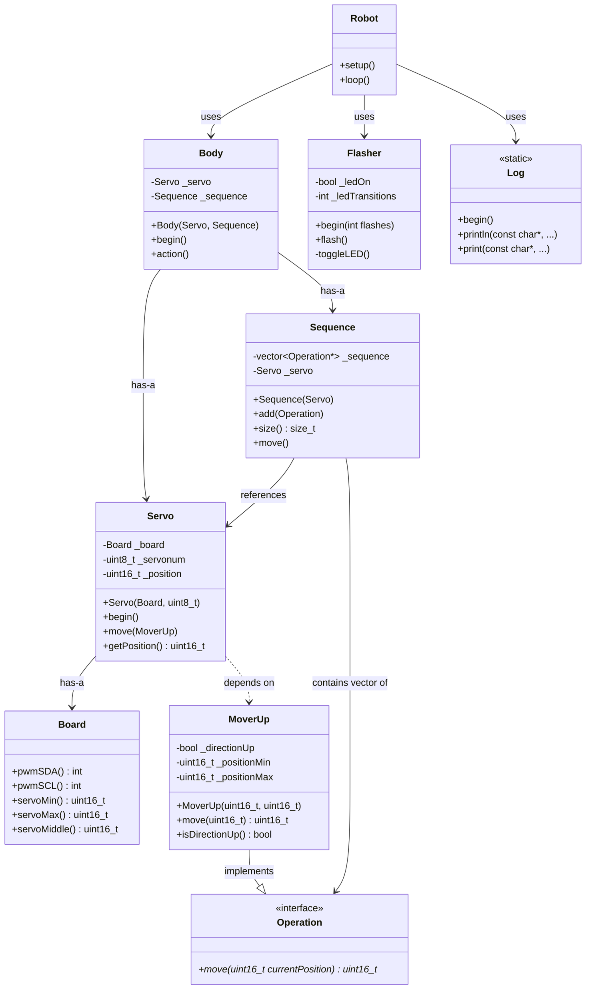

# Robot Spider Project Analysis

## Overview

This is an Arduino-based hexapod robot spider project targeting the ESP32-CAM platform. The project is based on a free 3D-printed hexapod design from delta3robotics (Sixpack model).

**Current Status**: Work in progress - not yet functional (as noted in README)

**Hardware Platform**: ESP32-CAM (FQBN: esp32:esp32:esp32cam)

**Key Dependencies**:
- Adafruit BusIO
- Adafruit PWM Servo Driver Library

## Project Goals

The author is rewriting the robot software with several experimental objectives:

1. Remove all code from .ino files (keep them minimal)
2. Use C++ instances instead of global status structures
3. Declarative memory allocation
4. Include a testing library for unit tests

## Architecture

The project follows a clean object-oriented architecture with clear separation of concerns. The primary product code is stored in `libraries/robot/`.

### Directory Structure

```
robot-spider/
├── robot-spider.ino          # Main Arduino sketch (minimal - just setup/loop)
├── libraries/
│   ├── robot/                # Primary robot logic
│   │   ├── robot.{h,cpp}     # Main robot orchestrator
│   │   ├── body.{h,cpp}      # Body composition and control
│   │   ├── board.{h,cpp}     # Hardware configuration
│   │   ├── servo.{h,cpp}     # Servo motor abstraction
│   │   ├── sequence.{h,cpp}  # Movement sequence manager
│   │   └── mover_up.{h,cpp}  # Movement operation (up/down oscillation)
│   ├── logging/              # Logging utility
│   ├── flash/                # LED flasher for status
│   └── unit_test/            # Testing framework
├── tests/                    # Unit tests
└── gen/                      # Build output directory
```

## Class Model



## Class Descriptions

### Core Robot Classes (libraries/robot/)

#### Robot
- **Purpose**: Main entry point and orchestrator
- **Responsibilities**:
  - Initialize all subsystems (logging, flasher, body)
  - Run main control loop
  - Manage operation queue (planned)
- **Location**: `libraries/robot/robot.{h,cpp}`

#### Body
- **Purpose**: Composes all physical parts and controls them
- **Responsibilities**:
  - Manage servo and sequence instances
  - Execute movement actions via sequence
- **Current State**: Basic implementation - `begin()` is empty, `action()` delegates to sequence
- **Location**: `libraries/robot/body.{h,cpp}`

#### Servo
- **Purpose**: Abstraction layer over physical servo motors
- **Responsibilities**:
  - Initialize PWM communication via I2C (Wire library)
  - Control individual servo positions
  - Integrate with Adafruit PWM Servo Driver
- **Implementation Notes**:
  - Uses shared PWM driver instance (Adafruit_PWMServoDriver at 0x40)
  - PWM frequency set to 60Hz
  - Position range from SERVOMIN (150) to SERVOMAX (600)
  - Current position tracking
- **Location**: `libraries/robot/servo.{h,cpp}`

#### Board
- **Purpose**: Hardware configuration and constants
- **Responsibilities**:
  - Define PWM I2C pins (SDA/SCL)
  - Define servo pulse width limits and middle position
- **Constants**:
  - SERVOMIN: 150
  - SERVOMAX: 600
- **Location**: `libraries/robot/board.{h,cpp}`

#### Sequence
- **Purpose**: Manages a sequence of movement operations
- **Responsibilities**:
  - Store and manage a vector of Operation pointers
  - Execute all operations in sequence on a servo
  - Apply computed positions to the servo
- **Implementation**:
  - Iterates through all operations
  - Each operation computes next position based on current
  - Applies final positions to servo
- **Location**: `libraries/robot/sequence.{h,cpp}`

#### Operation (MISSING - BUG!)
- **Purpose**: Base interface for movement operations
- **Status**: **Referenced but not implemented** - `operation.h` does not exist
- **Expected Interface**: `virtual uint16_t move(uint16_t currentPosition) = 0`
- **Impact**: This is likely preventing compilation
- **Referenced in**: `mover_up.h`, `sequence.h`

#### MoverUp
- **Purpose**: Concrete operation that oscillates servo position up and down
- **Responsibilities**:
  - Move servo position up by DISTANCE (5) until max reached
  - Move servo position down by DISTANCE until min reached
  - Automatically reverse direction at boundaries
- **Implementation**:
  - Maintains direction state (_directionUp)
  - Operates within configured min/max bounds
  - Simple oscillation behavior
- **Location**: `libraries/robot/mover_up.{h,cpp}`

### Support Libraries

#### Flasher (libraries/flash/)
- **Purpose**: Status LED flasher for ESP32-CAM
- **Pin**: GPIO 33 (ESP_LED_PIN)
- **Responsibilities**: Toggle LED on/off for visual status indication
- **Location**: `libraries/flash/flasher.{h,cpp}`

#### Log (libraries/logging/)
- **Purpose**: Serial logging utility
- **Responsibilities**:
  - Initialize serial communication
  - Provide printf-style logging functions
- **Configuration**:
  - Baudrate: 9600
  - 8 data bits, no parity, 1 stop bit
  - DTR/RTS enabled
- **Location**: `libraries/logging/logging.{h,cpp}`

## Current Implementation State

### What Works
- Clean object-oriented architecture
- Proper dependency injection (references passed to constructors)
- Declarative memory allocation (no dynamic allocation)
- Minimal .ino file (just setup/loop delegation)
- Testing framework in place
- Build system using arduino-cli

### Known Issues

1. **Missing Operation Interface** (CRITICAL)
   - `operation.h` is referenced but doesn't exist
   - This prevents compilation
   - Both `MoverUp` and `Sequence` depend on it

2. **Incomplete Servo Integration**
   - In `servo.cpp:26`, the actual PWM write is commented out: `// pwm.setPWM(_servonum, 0, _position);`
   - Sequence references `_servo.getPosition()` but this method is not defined in servo.h

3. **Placeholder Body Implementation**
   - `Body::begin()` is empty
   - Limited functionality in current iteration

4. **Incomplete Robot Design**
   - Comments in code indicate planned structure (Knee, Shoulder, Leg classes) not yet implemented
   - Only one servo being controlled currently
   - No actual hexapod leg coordination

### Design Intent (from README and comments)

The planned robot structure should have:
- **Head**: Contains camera (ESP32-CAM)
- **Body**: Contains left and right leg groups
- **Leg Groups**: 3 legs each (left/right)
- **Legs**: Each has shoulder and knee joints
- **Joints**: Each holds a servo motor

The intended control flow:
1. Initialize from off state
2. Run test cycle
3. Enter ready state
4. Execute operations (user-selected or generated)
5. Check operation queue
6. Return to ready state when idle

## Possible Features to Add

### Critical Fixes
1. **Create Operation Interface**
   - Define `operation.h` with base Operation class/interface
   - Add virtual `move()` method
   - This will unblock compilation and testing

2. **Fix Servo::getPosition()**
   - Add getter method to Servo class
   - Return current `_position` value

3. **Enable PWM Servo Control**
   - Uncomment `pwm.setPWM()` call in `servo.cpp`
   - Test with actual hardware

### Core Hexapod Features

4. **Complete Physical Model**
   - Implement `Leg` class (shoulder + knee servos)
   - Implement `LegGroup` class (3 legs)
   - Expand `Body` to manage 2 leg groups (6 legs total)
   - Map servo numbers to physical joints

5. **Movement Sequences**
   - Implement basic walking gaits (tripod, wave, ripple)
   - Create `Gait` class to encode walking patterns
   - Implement turn left/right sequences
   - Add forward/backward/stop operations

6. **Coordinated Movement**
   - Synchronize multiple servos for leg coordination
   - Implement inverse kinematics for leg positioning
   - Add balance and stability control

### Control & Interface

7. **Remote Control**
   - Add WiFi connectivity (ESP32 built-in)
   - Implement web interface for control
   - Add mobile app control via Bluetooth/WiFi
   - Implement command protocol (REST API or WebSocket)

8. **Camera Integration**
   - Enable ESP32-CAM for video streaming
   - Add camera servo control (pan/tilt)
   - Implement basic computer vision (line following, object tracking)

9. **Operation Queue System**
   - Implement the planned operation queue
   - Add priority scheduling
   - Support composite operations (macro commands)

### Sensors & Feedback

10. **Sensor Integration**
    - Add distance sensors (ultrasonic/IR) for obstacle avoidance
    - Implement IMU for balance and orientation
    - Add current sensors for servo load monitoring
    - Battery voltage monitoring

11. **Autonomous Behaviors**
    - Obstacle avoidance
    - Edge detection (prevent falling)
    - Auto-return to charging station
    - Patrol mode with waypoint navigation

### Safety & Diagnostics

12. **Safety Features**
    - Emergency stop function
    - Servo position limits and safety bounds
    - Current limiting to prevent servo damage
    - Timeout protection for lost connections

13. **Diagnostics & Monitoring**
    - Servo health monitoring
    - Position feedback and calibration
    - Performance metrics (battery life, uptime)
    - Error reporting and recovery

### Enhanced Operations

14. **Advanced Movement Operations**
    - `MoverDown` (complement to MoverUp)
    - `MoverSweep` (custom angle range)
    - `MoverHold` (maintain position for duration)
    - `MoverSequential` (chain multiple moves)
    - `MoverSync` (synchronize multiple servos)

15. **Behavior System**
    - State machine for robot behaviors
    - Behavior composition (combine primitives)
    - Learned behaviors (record/playback movements)
    - Randomized "life-like" idle behaviors

### Testing & Development

16. **Enhanced Testing**
    - Expand unit test coverage
    - Add integration tests for full sequences
    - Hardware-in-loop testing framework
    - Simulation mode (test without hardware)

17. **Calibration System**
    - Servo calibration wizard
    - Store calibration in EEPROM/SPIFFS
    - Auto-calibration on startup
    - Individual servo trim adjustments

### Power Management

18. **Power Optimization**
    - Sleep modes when idle
    - Servo power management (disable when not moving)
    - Dynamic power budgeting
    - Low battery warnings and safe shutdown

### User Experience

19. **Configuration System**
    - Web-based configuration interface
    - Save/load movement sequences
    - Personality settings (movement speed, style)
    - User presets for different terrains

20. **Interactive Modes**
    - Follow-me mode (track person/object)
    - Dance mode (choreographed sequences)
    - Exploration mode (autonomous wandering)
    - Guard mode (patrol and alert)

## Build System

The project uses `arduino-cli` with a Makefile for builds:

- **Target**: ESP32-CAM (esp32:esp32:esp32cam)
- **Build path**: `gen/` directory
- **Commands**:
  - `make init` - Setup board manager and install dependencies
  - `make build` - Compile the project
  - `make upload` - Upload to device (requires SERIAL_PORT env var)
  - `make test` - Run unit tests
  - `make monitor` - Serial monitor
  - `make usb` - List available USB serial ports

## Testing

- Unit tests located in `tests/` directory
- Custom testing framework in `libraries/unit_test/`
- Test files: `mover_test.cpp`, `sequence_test.cpp`
- Tests compile separately from main project

## Recommendations

### Immediate Priorities

1. **Fix compilation issues** by creating the missing `operation.h` interface
2. **Add Servo::getPosition()** method
3. **Test basic servo movement** by enabling PWM output
4. **Verify hardware** with single servo before expanding

### Next Steps

5. Implement the full physical model (Leg, LegGroup classes)
6. Create basic walking gaits
7. Test with actual hexapod hardware
8. Add remote control capability

### Long-term Vision

9. Autonomous navigation with sensors
10. Camera-based behaviors
11. Advanced movement and behaviors
12. User-friendly control interface

---

**Document Generated**: 2025-11-13
**Project Path**: `/Users/esumerfd/GoogleDrive/edward/Personal/projects/arduino/robot-spider`
**Analysis Tool**: Claude Code
