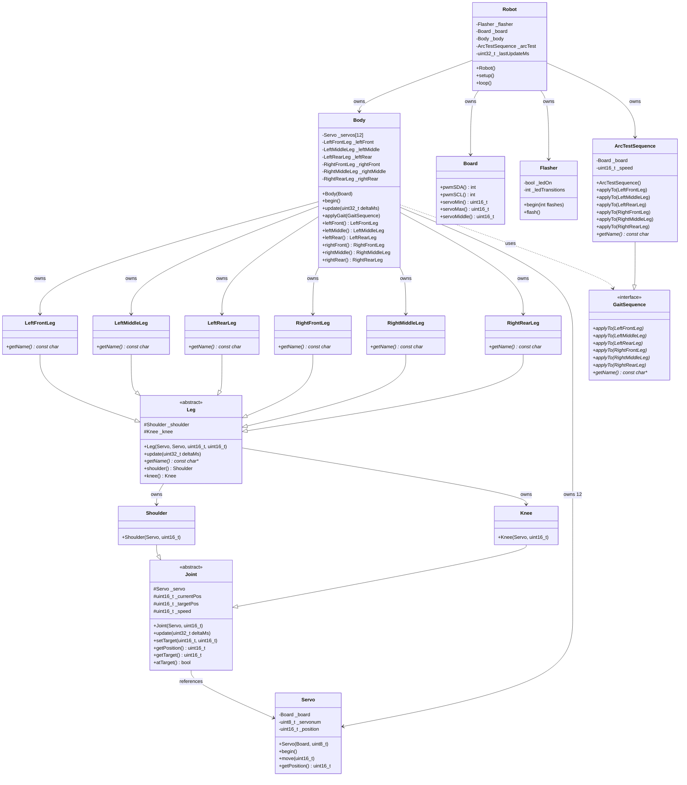

# Robot Spider Project Analysis

## Overview

This is an Arduino-based hexapod robot spider project targeting the ESP32-CAM platform. The project is based on a free 3D-printed hexapod design from delta3robotics (Sixpack model).

**Current Status**: Active development - implementing time-based movement system with named legs

**Hardware Platform**: ESP32-CAM (FQBN: esp32:esp32:esp32cam)

**Key Dependencies**:
- Adafruit BusIO
- Adafruit PWM Servo Driver Library

## Project Goals

The author is rewriting the robot software with several experimental objectives:

1. ✅ Remove all code from .ino files (keep them minimal)
2. ✅ Use C++ instances instead of global status structures
3. ✅ Declarative memory allocation (no dynamic allocation)
4. ✅ Include a testing library for unit tests

**All goals have been achieved!**

## Architecture

The project follows a clean object-oriented architecture with clear separation of concerns. The primary product code is stored in `libraries/robot/`.

### Design Principles

**Joint-Centric Architecture:**
- Each physical joint (Shoulder, Knee) owns its servo and movement logic
- Time-based movement enables smooth, speed-controlled motion
- Named legs encapsulate leg-specific positioning and kinematics

**Stateless Sequences:**
- Sequences describe movements without holding state
- Can be reapplied to continue motion patterns
- Same sequence can affect different legs differently

**Clear Ownership:**
- Body owns all 12 servos and 6 named legs
- Legs own their joints (shoulder + knee)
- Joints reference servos (no copying)

### Directory Structure

```
robot-spider/
├── robot-spider.ino          # Main Arduino sketch (minimal - just setup/loop)
├── libraries/
│   ├── robot/                # Primary robot logic
│   │   ├── robot.{h,cpp}     # Main robot orchestrator
│   │   ├── body.{h,cpp}      # Body - owns 6 named legs
│   │   ├── board.{h,cpp}     # Hardware configuration
│   │   ├── servo.{h,cpp}     # Servo motor abstraction
│   │   ├── joint.{h,cpp}     # Base joint with time-based movement
│   │   ├── shoulder.{h,cpp}  # Shoulder joint
│   │   ├── knee.{h,cpp}      # Knee joint
│   │   ├── leg.{h,cpp}       # Base leg class
│   │   ├── left_front_leg.{h,cpp}   # Named leg: LeftFront
│   │   ├── left_middle_leg.{h,cpp}  # Named leg: LeftMiddle
│   │   ├── left_rear_leg.{h,cpp}    # Named leg: LeftRear
│   │   ├── right_front_leg.{h,cpp}  # Named leg: RightFront
│   │   ├── right_middle_leg.{h,cpp} # Named leg: RightMiddle
│   │   ├── right_rear_leg.{h,cpp}   # Named leg: RightRear
│   │   ├── gait_sequence.h   # Sequence interface
│   │   └── arc_test_sequence.{h,cpp} # Test sequence (2-second arcs)
│   ├── logging/              # Logging utility
│   ├── flash/                # LED flasher for status
│   └── unit_test/            # Testing framework
├── tests/                    # Unit tests
└── gen/                      # Build output directory
```

## Class Model



## Class Descriptions

### Core Robot Classes (libraries/robot/)

#### Robot
- **Purpose**: Main entry point and orchestrator
- **Responsibilities**:
  - Initialize all subsystems (logging, flasher, body)
  - Run main control loop with time-based updates
  - Apply gait sequences
  - Track elapsed time (deltaMs) for smooth movement
- **Key Members**:
  - `_board` - Hardware configuration
  - `_body` - Owns all 6 legs and 12 servos
  - `_arcTest` - Test sequence for 2-second arcs
  - `_lastUpdateMs` - Tracks time for deltaMs calculation
- **Location**: `libraries/robot/robot.{h,cpp}`

#### Body
- **Purpose**: Composes and coordinates all physical components
- **Responsibilities**:
  - Own all 12 servos (2 per leg × 6 legs)
  - Own all 6 named leg instances
  - Initialize all servos
  - Update all legs based on elapsed time
  - Apply gait sequences to all legs
- **Key Members**:
  - 12 `Servo` objects (servos 0-11)
  - 6 named `Leg` objects (LeftFront, LeftMiddle, LeftRear, RightFront, RightMiddle, RightRear)
- **Design Pattern**: Composite - manages collection of legs
- **Location**: `libraries/robot/body.{h,cpp}`

#### Joint (Abstract Base Class)
- **Purpose**: Base class for all joints with time-based movement
- **Responsibilities**:
  - Store current and target positions
  - Move smoothly towards target based on speed and elapsed time
  - Provide position tracking and target detection
- **Key Features**:
  - Speed-controlled movement (units per second)
  - Time-based updates using deltaMs
  - Automatic stopping at target
- **Implementation**: Uses simple linear interpolation
- **Location**: `libraries/robot/joint.{h,cpp}`

#### Shoulder
- **Purpose**: Shoulder joint - controls leg lifting and positioning
- **Inheritance**: Extends `Joint`
- **Future**: Can override movement logic for shoulder-specific kinematics
- **Location**: `libraries/robot/shoulder.{h,cpp}`

#### Knee
- **Purpose**: Knee joint - controls leg extension and retraction
- **Inheritance**: Extends `Joint`
- **Future**: Can override movement logic for knee-specific kinematics
- **Location**: `libraries/robot/knee.{h,cpp}`

#### Leg (Abstract Base Class)
- **Purpose**: Base class for all legs
- **Responsibilities**:
  - Own shoulder and knee joints
  - Update both joints based on elapsed time
  - Provide access to joints for sequence application
  - Define leg name for debugging
- **Key Members**:
  - `_shoulder` - Shoulder joint instance
  - `_knee` - Knee joint instance
- **Location**: `libraries/robot/leg.{h,cpp}`

#### Named Leg Classes (6 classes)
- **LeftFrontLeg**, **LeftMiddleLeg**, **LeftRearLeg**
- **RightFrontLeg**, **RightMiddleLeg**, **RightRearLeg**
- **Purpose**: Specific leg instances with unique identities
- **Responsibilities**:
  - Provide leg name for debugging
  - (Future) Override movement methods for leg-specific positioning
  - (Future) Encapsulate leg-specific kinematics (e.g., "forward 10mm" differs per leg)
- **Design Rationale**:
  - Type-safe leg identification
  - Enables leg-specific behavior in sequences
  - Compiler-enforced correctness
- **Locations**:
  - `libraries/robot/left_front_leg.{h,cpp}`
  - `libraries/robot/left_middle_leg.{h,cpp}`
  - `libraries/robot/left_rear_leg.{h,cpp}`
  - `libraries/robot/right_front_leg.{h,cpp}`
  - `libraries/robot/right_middle_leg.{h,cpp}`
  - `libraries/robot/right_rear_leg.{h,cpp}`

#### GaitSequence (Interface)
- **Purpose**: Interface for stateless movement sequences
- **Responsibilities**:
  - Define `applyTo()` method for each of the 6 named leg types
  - Provide sequence name for debugging
- **Design Philosophy**:
  - Sequences are **stateless descriptions** of movement
  - Can be reapplied to continue motion patterns
  - Same sequence affects different legs differently
- **Key Feature**: Type-safe dispatch - each leg type gets its own method
- **Location**: `libraries/robot/gait_sequence.h`

#### ArcTestSequence
- **Purpose**: Test sequence for 2-second arc movement
- **Responsibilities**:
  - Calculate speed for 2-second movement (range / 2 seconds)
  - Apply to LeftFrontLeg shoulder (toggles between min/max)
  - Provide no-op implementation for other legs (not yet connected)
- **Implementation**:
  - Speed: 225 units/second (450 unit range ÷ 2 seconds)
  - Toggles target between servoMin and servoMax
  - Logs each target change
- **Testing**: Currently only LeftFrontLeg shoulder servo is physically connected
- **Location**: `libraries/robot/arc_test_sequence.{h,cpp}`

#### Servo
- **Purpose**: Abstraction layer over physical servo motors
- **Responsibilities**:
  - Initialize PWM communication via I2C (Wire library)
  - Control individual servo positions
  - Integrate with Adafruit PWM Servo Driver
  - Track current position
- **Implementation Notes**:
  - Uses shared PWM driver instance (Adafruit_PWMServoDriver at 0x40)
  - PWM frequency set to 60Hz
  - Position range from SERVOMIN (150) to SERVOMAX (600)
  - Servo numbers 0-11 map to physical PWM channels
- **Location**: `libraries/robot/servo.{h,cpp}`

#### Board
- **Purpose**: Hardware configuration and constants
- **Responsibilities**:
  - Define PWM I2C pins (SDA/SCL)
  - Define servo pulse width limits and middle position
- **Constants**:
  - SERVOMIN: 150
  - SERVOMAX: 600
  - SERVOMIDDLE: 375
- **Location**: `libraries/robot/board.{h,cpp}`

### Support Libraries

#### Flasher (libraries/flash/)
- **Purpose**: Status LED flasher for ESP32-CAM
- **Pin**: GPIO 33 (ESP_LED_PIN)
- **Responsibilities**: Toggle LED on/off for visual status indication
- **Location**: `libraries/flash/flasher.{h,cpp}`

#### Log (libraries/logging/)
- **Purpose**: Serial logging utility
- **Responsibilities**:
  - Initialize serial communication
  - Provide printf-style logging functions
- **Configuration**:
  - Baudrate: 9600
  - 8 data bits, no parity, 1 stop bit
  - DTR/RTS enabled
- **Location**: `libraries/logging/logging.{h,cpp}`

## Current Implementation State

### What Works ✅

- **Clean object-oriented architecture** with named legs
- **Time-based movement system** for smooth servo control
- **Proper encapsulation** - Body owns servos, Legs own joints, Joints reference servos
- **Declarative memory allocation** - no dynamic allocation, all stack-based
- **Minimal .ino file** - just setup/loop delegation
- **Testing framework** in place
- **Stateless sequence system** - sequences can be reapplied
- **2-second arc movement** - ArcTestSequence demonstrates time-based control
- **Full hexapod support** - All 6 legs with 12 servos ready
- **Build system** using arduino-cli

### Current Testing Status

**Hardware Connected:**
- LeftFrontLeg shoulder servo (servo #0)

**Testing Behavior:**
- Moves servo #0 in 2-second arcs (min → max → min)
- Automatically reapplies sequence when target reached
- Demonstrates stateless sequence pattern
- All other legs initialized but not moving (no hardware connected)

### Architectural Achievements

1. **Solved Static Initialization Order Fiasco**
   - Member initializer lists guarantee construction order
   - No global variables
   - Everything encapsulated in Robot class

2. **Type-Safe Leg Management**
   - 6 named leg classes (not array indexing)
   - Compiler enforces correct leg usage
   - Sequences dispatch by leg type

3. **Time-Based Animation**
   - Smooth movement independent of loop frequency
   - Speed-controlled joints (units per second)
   - Delta time tracking in Robot::loop()

4. **Scalable Design**
   - Easy to add new sequences (implement GaitSequence)
   - Leg-specific behaviors encapsulated in named classes
   - Clear ownership and lifetime management

### Design Intent (Fully Implemented)

The hexapod structure is now complete:
- ✅ **Body**: Contains 6 named legs
- ✅ **Legs**: Each has shoulder and knee joints (LeftFront, LeftMiddle, LeftRear, RightFront, RightMiddle, RightRear)
- ✅ **Joints**: Each holds a servo and provides time-based movement
- ✅ **Servos**: 12 total (servo numbers 0-11)

The control flow:
1. ✅ Initialize from off state
2. ✅ Apply gait sequence to configure movement
3. ⏳ Execute time-based updates in loop
4. ⏳ Check for sequence completion and reapply
5. ⏳ Support multiple sequences (walk, turn, etc.)

## Future Features

### Immediate Next Steps

1. **Enable PWM Servo Control**
   - Uncomment `pwm.setPWM()` call in `servo.cpp`
   - Test with actual hardware

2. **Connect Remaining Servos**
   - Wire up servos 1-11
   - Test each leg independently

3. **Create Real Gaits**
   - `TripodGait` - Classic tripod walking pattern
   - `WaveGait` - Wave walking pattern
   - `RippleGait` - Ripple walking pattern

### Core Movement Features

4. **Inverse Kinematics**
   - Calculate joint angles for foot positions
   - Implement in named leg classes
   - Enable "move foot to (x,y,z)" commands

5. **Gait Library**
   - Forward/backward walking
   - Turn left/right
   - Strafe left/right
   - Speed control

6. **Smooth Transitions**
   - Blend between gaits
   - Acceleration/deceleration
   - Balance maintenance

### Control & Interface

7. **Remote Control**
   - WiFi connectivity (ESP32 built-in)
   - Web interface for control
   - Mobile app control via Bluetooth/WiFi
   - Command protocol (REST API or WebSocket)

8. **Camera Integration**
   - Enable ESP32-CAM for video streaming
   - Add camera servo control (pan/tilt)
   - Basic computer vision (line following, object tracking)

### Sensors & Autonomy

9. **Sensor Integration**
   - Distance sensors (ultrasonic/IR) for obstacle avoidance
   - IMU for balance and orientation
   - Current sensors for servo load monitoring
   - Battery voltage monitoring

10. **Autonomous Behaviors**
    - Obstacle avoidance
    - Edge detection (prevent falling)
    - Auto-return to charging station
    - Patrol mode with waypoint navigation

### Advanced Features

11. **Learning & Adaptation**
    - Record and playback movement sequences
    - Terrain adaptation
    - Load balancing across legs
    - Energy-efficient movement patterns

12. **Safety & Diagnostics**
    - Emergency stop function
    - Servo position limits and safety bounds
    - Current limiting to prevent servo damage
    - Performance metrics (battery life, uptime)
    - Error reporting and recovery

## Build System

The project uses `arduino-cli` with a Makefile for builds:

- **Target**: ESP32-CAM (esp32:esp32:esp32cam)
- **Build path**: `gen/` directory
- **Commands**:
  - `make init` - Setup board manager and install dependencies
  - `make build` - Compile the project
  - `make upload` - Upload to device (requires SERIAL_PORT env var)
  - `make test` - Run unit tests
  - `make monitor` - Serial monitor
  - `make usb` - List available USB serial ports

**Current Build Stats:**
- Program: 331,996 bytes (10% of 3MB flash)
- RAM: 20,828 bytes (6% of 327KB)

## Testing

- Unit tests located in `tests/` directory
- Custom testing framework in `libraries/unit_test/`
- Legacy tests removed with architecture refactoring
- TODO: Create new tests for Joint/Leg/Sequence architecture

## Architecture Patterns Used

1. **Composite Pattern** - Body manages collection of Legs
2. **Strategy Pattern** - GaitSequence interface for swappable gaits
3. **Template Method** - Joint base class with overridable behavior
4. **Dependency Injection** - References passed to constructors
5. **Factory Pattern** - Body constructs all servos and legs
6. **Command Pattern** - Sequences as stateless commands

## Memory Management

- **Zero dynamic allocation** - all objects stack-based
- **Clear ownership** - Body owns servos and legs, Legs own joints
- **Reference semantics** - Joints reference servos (no copying)
- **Compile-time sizing** - all arrays and structures known at compile time
- **Guaranteed initialization order** - member initializer lists

---

**Document Updated**: 2025-11-15
**Project Path**: `/Users/esumerfd/GoogleDrive/edward/Personal/projects/arduino/robot-spider`
**Analysis Tool**: Claude Code
**Architecture**: Joint-Centric with Named Legs and Stateless Sequences
